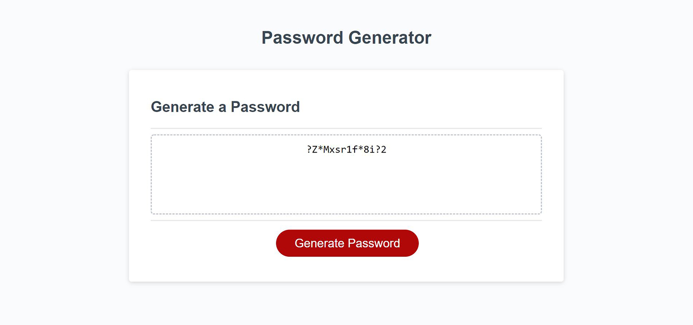

# Password Generator

*An example of a suggested password*

## The Challenge

I was asked to build a password generator using Javascript that would suggest a strong password based on a few criteria, including:

1. The suggested password should have a length between 8 and 128 characters, as selected by the user.
2. The suggested password should feature a character pool consisting of lowercase letters, uppercase letters, numbers, and/or special characters, as selected by the user.
3. All user responses should be validated automatically for accuracy, with minimal disruption to the user experience.

The code is neatly organized and commented for easy maintenance.

_Note: the special characters I included are !@#$%^&*?~+/_

## Contact

Brett Piper - <bpiper91@gmail.com>

Deployed application: <https://bpiper91.github.io/password-generator>

GitHub repo: <https://github.com/bpiper91/password-generator>